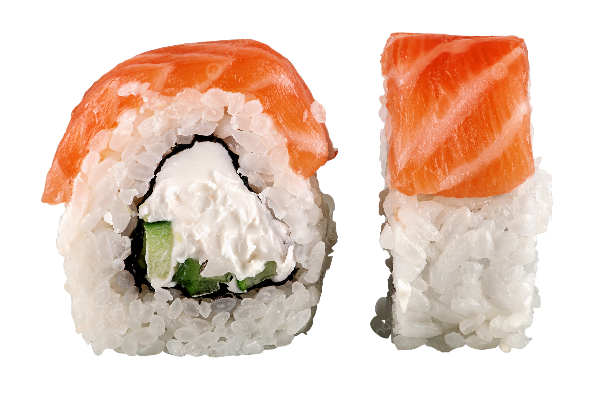

# Sushi & Grill — Modern Online Ordering System

> A production-grade, full-stack ordering platform built with **React**, **TypeScript**, **Tailwind CSS**, and **Supabase (InsForge)**. Designed for speed, reliability, and a premium "Arabic-first" user experience.



## 🚀 Key Features

### For Customers
- **⚡ Quick Add Flow**: Add items to cart instantly without modal interruptions.
- **🔍 Smart Product Details**: Deep dive into ingredients and special instructions with a mobile-first bottom sheet.
- **🛒 Intelligent Cart**: Automatically merges identical items but keeps custom orders separate.
- **📱 Responsive Design**: Fully optimized for mobile, tablet, and desktop with smooth animations.
- **🛑 Real-time Operations**: Status badge updates instantly when the store opens/closes.

### For Admins
- **🎛️ Operational Control**: Toggle store status, manage category availability, and set minimum order quantities.
- **📊 Live Order Dashboard**: Real-time view of incoming orders with status tracking.
- **🛡️ Server-Side Validation**: Robust edge functions ensure no invalid orders slip through.

## 🛠️ Tech Stack

- **Frontend**: React 18, TypeScript, Vite
- **Styling**: Tailwind CSS, Framer Motion (animations), Lucide (icons)
- **State Management**: Zustand (persisted local storage)
- **Backend & DB**: InsForge (Supabase)
- **Edge Functions**: Deno (server-side validation)
- **UI Components**: Radix UI primitives, Sonner (toast notifications)

## 🏗️ Architecture Highlights

### 1. Robust State Management
Uses **Zustand** for a lightweight, performant store. The `useStore` hook manages:
- **Cart Logic**: Complex deduplication based on `cartKey` (Product ID + attributes).
- **Business Rules**: Fetches and enforces rules like "Minimum Order Quantity" globally.
- **Persistence**: Cart and user sessions survive page reloads.

### 2. Edge-First Validation
Critical business logic is enforced on the server (Edge Functions) to prevent client-side manipulation:
- Checks store open/close status in real-time.
- Validates product availability and price integrity.
- Enforces category-specific limitations.

### 3. Arabic-First Design System
Built from the ground up for RTL (Right-to-Left) support:
- Custom font: **IBM Plex Sans Arabic**.
- RTL-aware spacing and layout utilities.
- Cultural localization (currency formatting, translations).

## 📂 Project Structure

```bash
src/
├── app/
│   ├── components/       # UI Components (ProductCard, CartSidebar, AdminView...)
│   ├── store/           # Zustand state management
│   ├── functions/       # Edge functions (validate-order)
│   ├── App.tsx          # Main application status & routing
│   └── main.tsx         # Entry point
├── lib/                 # Utilities (InsForge client, helpers)
├── styles/              # Global CSS & Tailwind config
└── public/              # Static assets
```

## 🚀 Getting Started

### Prerequisites
- Node.js 18+
- npm or pnpm

### Installation

1. **Clone the repo**
   ```bash
   git clone https://github.com/yousef-ehabb/sushi-grill-ordering-app.git
   cd sushi-grill-ordering-app
   ```

2. **Install dependencies**
   ```bash
   npm install
   ```

3. **Start development server**
   ```bash
   npm run dev
   ```

## 🔒 Security & Performance
- **RLS (Row Level Security)** enabled on all database tables.
- **Optimistic UI** updates for instant feedback.
- **Lazy Loading** for images and heavy components.

---

**Author**: [Yousef Ehab](https://github.com/yousef-ehabb)
