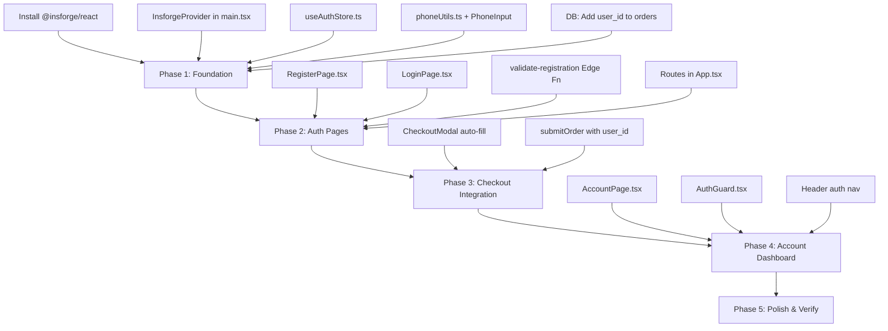

# Authentication System — V1 Plan

Simple, production-safe auth for Sushi & Grill ordering app.  
**Core principle:** Guest checkout remains the primary flow. Accounts are optional.

---

## Architecture Decision

| Decision | Choice | Rationale |
|----------|--------|-----------|
| Auth Provider | InsForge built-in auth | Secure sessions, HTTP-only cookies, password hashing handled automatically |
| Login identifier | **Email + Password** | InsForge SDK requires email-based auth |
| Phone storage | User profile custom field | Stored via `setProfile({ phone, address })` |
| Phone format | Egyptian `+201XXXXXXXXX` | Fixed `+20` prefix, user enters 10 digits |
| Email verification | **Disabled for V1** | Reduces friction, can be enabled later |
| State management | New `useAuthStore` (Zustand) | Separated from main store for clean architecture |

---

## Proposed Changes

### 1. Backend — Database

#### [MODIFY] `orders` table (via SQL migration)

Add `user_id` column (nullable UUID) to link orders to authenticated users:

```sql
ALTER TABLE orders ADD COLUMN user_id TEXT DEFAULT NULL;
```

- `user_id = NULL` → Guest order (existing behavior preserved)
- `user_id = 'usr_xxx'` → Logged-in user's order

#### RLS Policy Updates

- Add policy: Authenticated users can SELECT their own orders (`user_id = auth.uid()`)
- Keep existing public INSERT policy for guest orders

---

### 2. Backend — InsForge Config

#### Disable email verification

Set `requireEmailVerification: false` in InsForge dashboard (or via API).

---

### 3. Frontend — New Files

#### [NEW] `src/app/store/useAuthStore.ts`

Auth state management (Zustand):
- `user`, `isAuthenticated`, `isLoading`
- `signUp()` — email + password + name + phone
- `signIn()` — email + password  
- `signOut()`
- `initSession()` — restore session on app load via `getCurrentSession()`
- `updateProfile()` — update name, phone, address via `setProfile()`

#### [NEW] `src/app/components/auth/RegisterPage.tsx`

Registration form:
- Full Name (required)
- Email (required, login identifier)
- Phone — fixed `+20` prefix + 10-digit input (required)
- Password + Confirm Password (required)
- Address (optional)
- Client-side validation: Egyptian phone format, email format, password match
- On success → auto-login → redirect to `/`

#### [NEW] `src/app/components/auth/LoginPage.tsx`

Login form:
- Email (required)
- Password (required)
- Link to register page
- On success → redirect to `/`

#### [NEW] `src/app/components/auth/AccountPage.tsx`

User dashboard:
- **Profile section:** Editable name, phone, address, email (read-only)
- **Order history:** Table with Order ID, Date, Status, Total
- Uses `user_id` to fetch from `orders` table

#### [NEW] `src/app/components/auth/AuthGuard.tsx`

Route protection component for account page (redirects to `/login` if not authenticated).

#### [NEW] `src/lib/phoneUtils.ts`

Phone validation & normalization utilities:
- `normalizePhone(input)` → `+201XXXXXXXXX`
- `validateEgyptianPhone(input)` → boolean
- `formatPhoneDisplay(stored)` → `010 1234 5678`

#### [NEW] `src/app/components/ui/PhoneInput.tsx`

Reusable phone input component with fixed `+20` prefix badge, 10-digit input, real-time validation.

---

### 4. Frontend — Modified Files

#### [MODIFY] `src/main.tsx`

- Wrap app with `InsforgeProvider` from `@insforge/react`
- Call `initSession()` on mount

#### [MODIFY] `src/app/App.tsx`

Add new routes:
- `/register` → RegisterPage
- `/login` → LoginPage  
- `/account` → AuthGuard → AccountPage
- Add auth nav items to header (Login/Register or User avatar)

#### [MODIFY] `src/app/components/CheckoutModal.tsx`

- If authenticated → auto-fill name, phone, address from profile
- Allow user to edit auto-filled fields
- Pass `user_id` to `submitOrder()` if logged in

#### [MODIFY] `src/app/store/useStore.ts`

- Update `submitOrder()` to accept optional `user_id`
- Insert `user_id` into orders table when present

#### [MODIFY] `src/app/components/CustomerView.tsx`

- Add Login/Register buttons in header (when signed out)
- Add User avatar/menu (when signed in) with Account/Logout links

---

### 5. Backend — Edge Function

#### [NEW] `scripts/validate-registration.js`

Server-side validation for registration:
- Validate Egyptian phone format
- Normalize phone to `+201XXXXXXXXX`
- Check phone uniqueness (query user profiles)
- Validate email format & uniqueness
- Sanitize inputs (trim whitespace)
- Return structured validation errors

---

### 6. Package Dependencies

```bash
npm install @insforge/react@latest
```

No other dependencies needed — InsForge SDK handles password hashing, sessions, tokens.

---

## File Impact Summary

| File | Action | Complexity |
|------|--------|-----------|
| `src/main.tsx` | MODIFY | Low |
| `src/app/App.tsx` | MODIFY | Medium |
| `src/app/store/useAuthStore.ts` | NEW | Medium |
| `src/app/components/auth/RegisterPage.tsx` | NEW | High |
| `src/app/components/auth/LoginPage.tsx` | NEW | Medium |
| `src/app/components/auth/AccountPage.tsx` | NEW | Medium |
| `src/app/components/auth/AuthGuard.tsx` | NEW | Low |
| `src/lib/phoneUtils.ts` | NEW | Low |
| `src/app/components/ui/PhoneInput.tsx` | NEW | Low |
| `src/app/components/CheckoutModal.tsx` | MODIFY | Medium |
| `src/app/store/useStore.ts` | MODIFY | Low |
| `src/app/components/CustomerView.tsx` | MODIFY | Medium |
| `scripts/validate-registration.js` | NEW | Medium |
| `orders` table migration | SQL | Low |

**Total: 8 new files, 5 modified files, 1 DB migration**

---

## Implementation Order



1. **Phase 1 — Foundation:** DB migration, install deps, auth store, phone utils, InsforgeProvider
2. **Phase 2 — Auth Pages:** Register/Login pages, Edge Function validation, routes
3. **Phase 3 — Checkout Integration:** Auto-fill, user_id linking
4. **Phase 4 — Account Dashboard:** Profile editing, order history
5. **Phase 5 — Polish:** Header nav, testing, mobile responsiveness

---

## Security Checklist

- [x] Passwords hashed by InsForge (bcrypt internally)
- [ ] Server-side phone validation in Edge Function
- [ ] Phone uniqueness enforcement
- [ ] Authenticated routes protected with AuthGuard
- [ ] `user_id` validated server-side before order linking
- [ ] Logout clears session properly (`signOut()`)
- [ ] No tokens in localStorage (InsForge uses HTTP-only cookies)
- [ ] Admin routes remain separately protected

---

## Future-Ready Hooks

| Feature | How to Add Later |
|---------|-----------------|
| OTP login | Add `signInWithOTP()` when InsForge supports it |
| Forgot password | Enable `sendResetPasswordEmail()` (already in SDK) |
| Email verification | Set `requireEmailVerification: true` in dashboard |
| SMS integration | Phone already stored as `+201XXXXXXXXX` — plug in SMS provider |

---

## UX Rules

- Registration form: max 6 fields, single page, no steps
- Login form: 2 fields only (email + password)
- Guest checkout unchanged — no popups asking to register
- Mobile-first: all forms use large touch targets (py-3.5+)
- Arabic RTL layout maintained throughout
- Subtle "إنشاء حساب" link in header, not a forced modal
